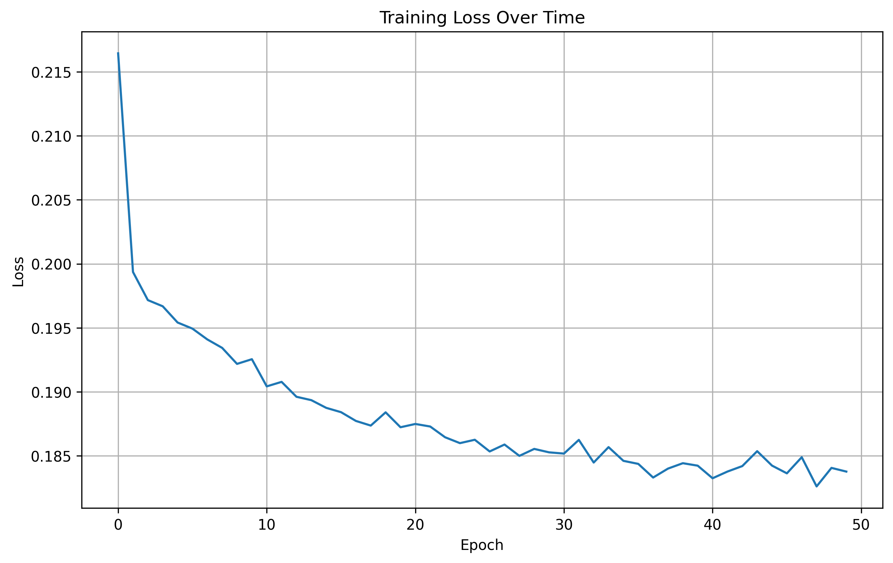
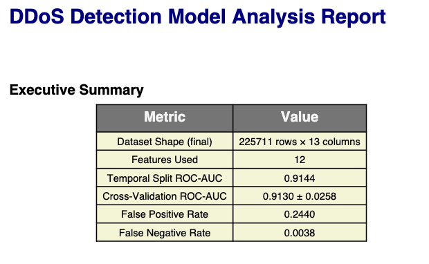
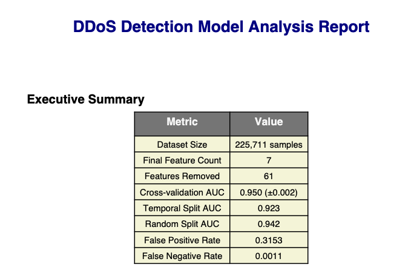
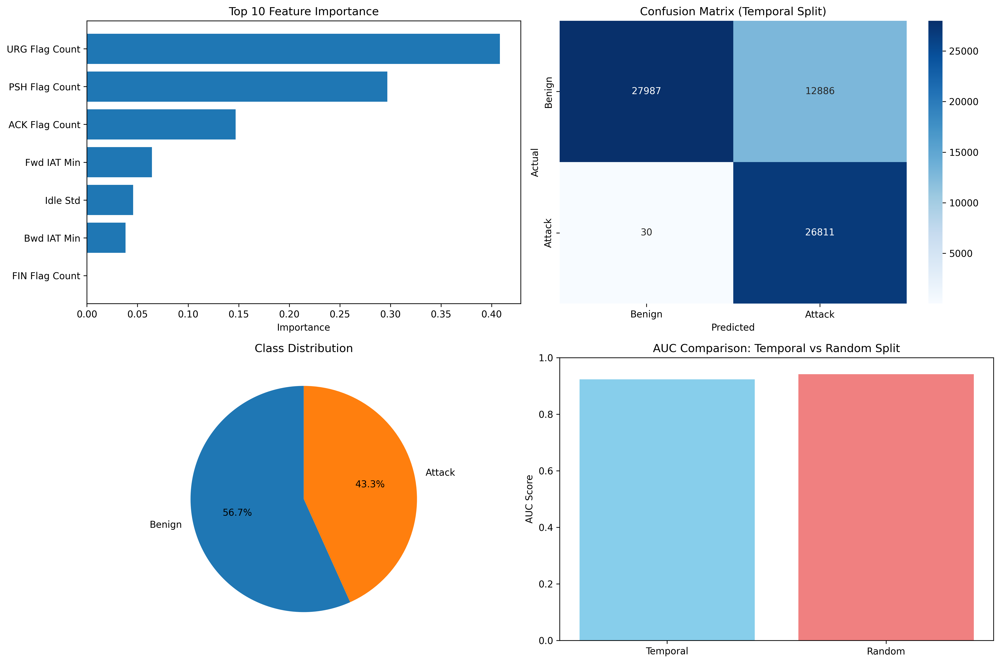

# DDOS-ML-Detection

Machine learning models for detecting Distributed Denial of Service (DDoS) attacks using network traffic data. This project implements both PyTorch and XGBoost approaches for comparison.

## Dataset

**Recommended: CIC-IDS 2017**

- **URL:** https://www.unb.ca/cic/datasets/ids-2017.html
- **Description:** Comprehensive dataset containing realistic network traffic with various attack types including botnets, DDoS attacks, and brute-force intrusions
- **Key Features:** Flow Bytes/s, Source IP, Destination IP, Protocol, Flow Duration
- **Use Case:** Ideal for developing and evaluating inbound/outbound traffic volume anomaly detection solutions

**Disclaimer:** I do not claim ownership of the CIC-IDS 2017 dataset. All intellectual property rights are reserved by its original creators.

## Setup

1. Download the CIC-IDS 2017 dataset from the URL above
2. Configure dataset paths in `config.py`:
```python
   DATAPATH_FRIDAY_WORK_HRS_AFTERNOON = "Absolute/Path/to/your/file.csv"
```
3. Import the config in your scripts:
```python
   from config import DATAPATH_FRIDAY_WORK_HRS_AFTERNOON
```

## Models

This project includes two implementations:

### 1. PyTorch Model

**Training:**
```bash
python3 PTorch_main.py
```

**Outputs:**
- Detailed log: `results/ddos_analysis_log_YYYYMMDD_HHMMSS.txt`
- PDF report: `results/ddos_analysis_report_YYYYMMDD_HHMMSS.pdf`
- Training loss plot: `plots/training_loss.png`
- Analysis visualization: `plots/ddos_ana_report.png`
- Model files:
  - `models/ddos_model_info.pkl`
  - `models/ddos_torch_model.pt`
  - `models/ddos_scaler.pkl`
  - `models/final_features.txt`

**Prediction on New Data:**
```bash
python3 predict_ddos_PYTORCH.py sample.csv
```

**Prediction Outputs:**
- `sample_predictions.csv` - Individual predictions
- `sample_prediction_summary.csv` - Summary statistics

#### PyTorch Results

**Training Loss:**



**Analysis Report:**



### 2. XGBoost Model

**Training:**
```bash
python3 XGBoost_main.py
```

**Outputs:**
- Detailed log: `results/ddos_analysis_YYYYMMDD_HHMMSS.log`
- PDF report: `results/ddos_analysis_report_YYYYMMDD_HHMMSS.pdf`
- Feature list: `results/final_features.txt`
- Visualizations:
  - `plots/ddos_analysis_YYYYMMDD_HHMMSS.png`
  - `plots/ddos_ana_report_xgb.png`
  - `plots/ddos_analysis_XGB_graphs.png`
- Model files:
  - `models/ddos_scaler_xgb.pkl`
  - `models/ddos_xgb_model.pkl`

#### XGBoost Results

**Analysis Report:**



**Detailed Analysis Graphs:**



## Project Structure
```
DDOS-ML-Detection/
├── config.py                    # Dataset path configuration
├── PTorch_main.py              # PyTorch model training
├── predict_ddos_PYTORCH.py     # PyTorch prediction script
├── XGBoost_main.py             # XGBoost model training
├── models/                     # Trained models and scalers
├── results/                    # Logs and reports
└── plots/                      # Visualizations and graphs
```

### **Install All Requirements**

If using the generated `requirements.txt`, run the following command in your terminal:

```bash
pip install -r requirements.txt
```

## Usage Notes

- Ensure your dataset paths are correctly configured in `config.py` before running any scripts
- Both models can be trained independently for comparison
- Prediction scripts require trained models to be present in the `models/` directory
- All outputs are timestamped to prevent overwriting previous results

## Contact

Maintained by @Dannychz7